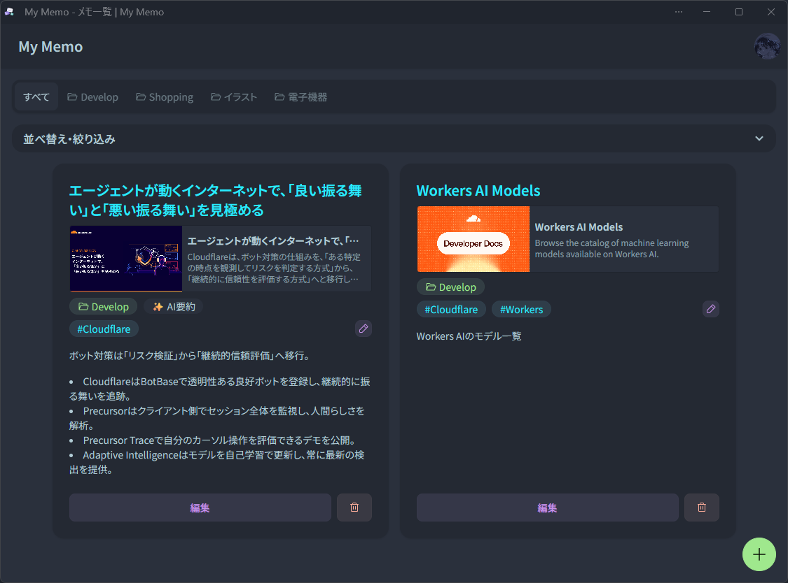

# My Memo



My Memoは、GitHubアカウントで利用する個人向けメモアプリです。
通常のメモ、WebページのAI要約、ファイル添付、カテゴリー、タグ、端末の共有メニューからの取り込みに対応します。

## ローカル開発

`.dev.vars`に次の値を設定します。

```dotenv
BETTER_AUTH_URL=http://localhost:5173
BETTER_AUTH_SECRET=<32文字以上のランダムな値>
GITHUB_CLIENT_ID=<GitHub OAuth AppのClient ID>
GITHUB_CLIENT_SECRET=<GitHub OAuth AppのClient Secret>
```

GitHub OAuth AppのAuthorization callback URLは`http://localhost:5173/api/auth/callback/github`にします。

```powershell
pnpm install
pnpm run db:local:migrate
pnpm run dev
```

## 検証

```powershell
pnpm run test:all
pnpm run build
pnpm run knip
```

## 文書

- [製品判断](docs/product-decisions.md)
- [運用とデータ変更](docs/operations.md)
- [Route配置規約](app/routes/-README.md)
